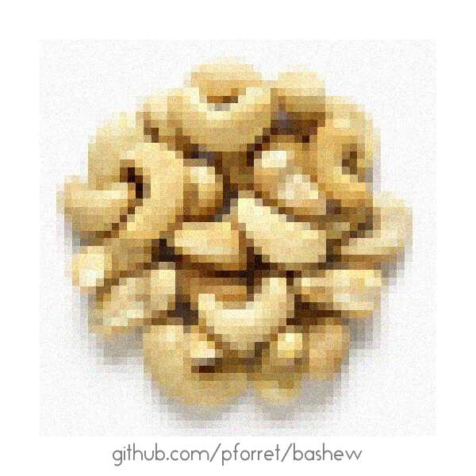

 

# bashew

bash script creator - from small stand-alone script to complex projects with CI/CD and testing

## Installation

* manually

        git clone https://github.com/pforret/bashew.git
        ln -s bashew/bashew.sh /usr/local/bin
    
* or with basher    

        basher install pforret/bashew
        
## Usage

### 1. create new bash script (without repo)

        bashew.sh script                # will ask for author & script details
    
### 2. create new bash project folder (with README.md ...)

        bashew.sh project               # will ask for author & script details     

----

  to be tested
  
### 3. create a bash script repo, with CI/CD, with README, with tests, with versioning ... 

* on [github.com/pforret/bashew](https://github.com/pforret/bashew), click on '**Use this template**'
* then clone your new repo

        git clone https://github.com/<you>/<your repo>.git
        cd <your repo>
        ./bashew.sh init             # will ask for details and initialise/clean up the repo

#### and then, if you have [semver.sh](https://github.com/pforret/semver):
        semver.sh push          # will commit and push new code
        semver.sh new patch     # will set new version to 0.0.1

  
### 4. git clone into new repo

        git clone --depth=1 https://github.com/pforret/bashew.git <newname>
        cd <newname>
        ./bashew.sh init             # will ask for details and iniialise/clean up the repo

## What's that name? Bashew?
* comes from 'bash new'
* rhymes with cashew
