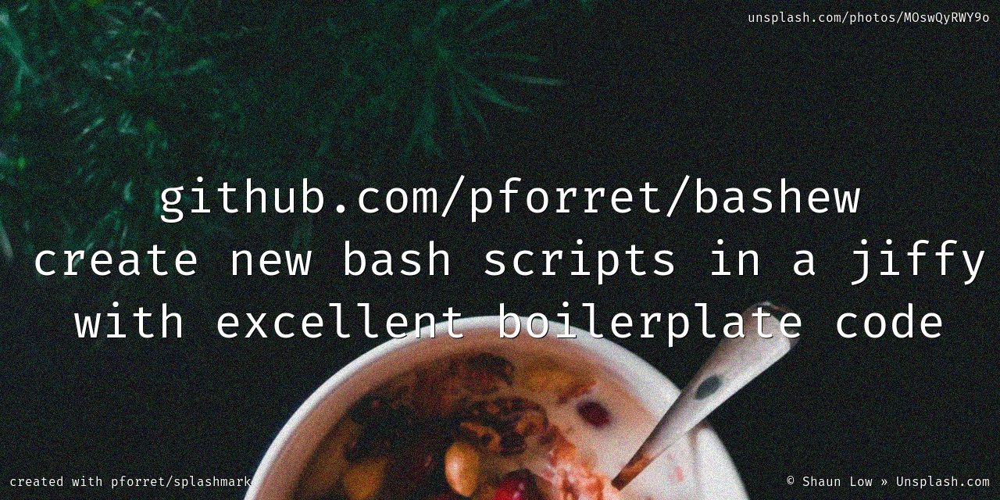

Part of [](https://blog.forret.com/portfolio/bashful/) network
/
Install with [](https://basher.gitparade.com/package/)

Latest tag: [](https://github.com/pforret/bashew/tags)
/
latest release: [](https://github.com/pforret/bashew/releases)
/


# bashew



bash script / project creator

## ⏳ TL;DR

to create a new stand-alone **SCRIPT** (just a xyz.sh script), with option parsing, color output (cf `1.`)

        bashew.sh script
    
to create a new standalone script **PROJECT** (in a folder, with README) (cf `2.`)

        bashew.sh project

to initialize a bashew-based **REPO** with CI/CD you just cloned (cf `3.`)

        bashew init
     
## 🎯 Features

* contained in 1 single file (no external dependencies)
* comes with `README.md`, `CHANGELOG.md`, ... markdown files
* edit only main() function and subroutines in beginning of script, all template code is at the end of the script
* definition of flags/options/parameters in 1 place only
* definition of dependencies (like curl, ffmpeg, imagemagick...) in 1 place only
* automatic creation of usage text based on definition above
* short/long option parsing, based on definition above
* several functions for output to stdout/stderr, with intelligent color usage (not when output is piped)
* reads a .env configuration file, if there is one
* predefined quiet (no output) and verbose (more output) modes
* folder for temporary files (with automatic cleanup)
* folder for log files (with automatic cleanup)
* easy CI/CD for Github (with shellcheck)
* correct determination of script installation folder (resolve symbolic links)
* see [features.md](doc/features.md) for detailed information

## 🔥 Usage

    Usage: bashew.sh [-h] [-q] [-v] [-f] [-t <tmpd>] [-l <logd>] [-n <name>] <action>
    Flags, options and parameters:
        -h|--help      : [flag] show usage [default: off]
        -q|--quiet     : [flag] no output [default: off]
        -v|--verbose   : [flag] output more [default: off]
        -f|--force     : [flag] do not ask for confirmation (always yes) [default: off]
        -t|--tmpd <val>: [optn] folder for temp files  [default: .tmp]
        -l|--logd <val>: [optn] folder for log files  [default: log]
        -n|--name <val>: [optn] name of new script or project
        <action>  : [parameter] action to perform: script/project/init/update

### 1. create new bash script (without repo)
```shell
bashew.sh script                    # will interactively ask for author & script details
bashew.sh -f script                 # will create new script with random name
bashew.sh -f -n "../list.sh" script # will create new script ../list.sh
```

Example:
```shell
$ bashew.sh -f script
…  Creating script ./towel_nappers.sh ...
./towel_nappers.sh

$ bashew.sh -f -q script
./iffiest_prepays.sh
```

### 2. create new bash project folder/repo (with README.md, CI/CD)
```shell
bashew.sh project               # will interactively ask for author & script details
bashew.sh -f project            # will create new project with random name
bashew.sh -f -n "tango" project # will create new project in folder "tango"
```

Example:

    > bashew.sh -f project
    …  Creating project ./tendon_mingle ...
    CHANGELOG.md README.md VERSION.md LICENSE .gitignore tendon_mingle.sh bitbucket-pipelines .github/workflows  
    ✔  next step: 'cd ./tendon_mingle' and start scripting!
  
### 3. create a bash script repo, with CI/CD, with README, with tests, with versioning ... 

* on [github.com/pforret/bashew](https://github.com/pforret/bashew), click on '**Use this template**'
* then clone your new repo
```shell
git clone https://github.com/<you>/<your repo>.git
cd <your repo>
./bashew.sh init             # will ask for details and initialise/clean up the repo
```

#### and then, if you have [setver.sh](https://github.com/pforret/setver):
```shell
setver push          # will commit and push new code
setver new patch     # will set new version to 0.0.1
setver set 1.0.0     # when your first working version is committed
```
  
### 4. git clone into new repo
```shell
git clone --depth=1 https://github.com/pforret/bashew.git <newname>
cd <newname>
./bashew.sh init             # will ask for details and iniialise/clean up the repo
```

## 🚀 Installation

* manually

        git clone https://github.com/pforret/bashew.git
        ln -s bashew/bashew.sh /usr/local/bin
    
* or with [basher](https://github.com/basherpm/basher) package manager

        basher install pforret/bashew

## 🙏 Acknowledgements

* [bash_unit](https://github.com/pgrange/bash_unit): bash unit testing enterprise edition framework (used for CI/CD)
* [shellcheck](https://github.com/koalaman/shellcheck): a static analysis tool for shell scripts (used for CI/CD)
* [bash-boilerplate (2012)](https://github.com/oxyc/bash-boilerplate) on which I based my [bash-boilerplate (2020)](https://github.com/pforret/bash-boilerplate) which eventually became this [bashew](https://github.com/pforret/bashew)
* Documentation from [Google](https://google.github.io/styleguide/shellguide.html), [BashPitfalls](https://mywiki.wooledge.org/BashPitfalls), [Microsoft](https://github.com/microsoft/code-with-engineering-playbook/blob/master/code-reviews/recipes/Bash.md)

## 🤔 What's that name? Bashew?
* derived from 'bash new'
* rhymes with cashew

## Stargazers over time

[](https://starchart.cc/pforret/bashew)
